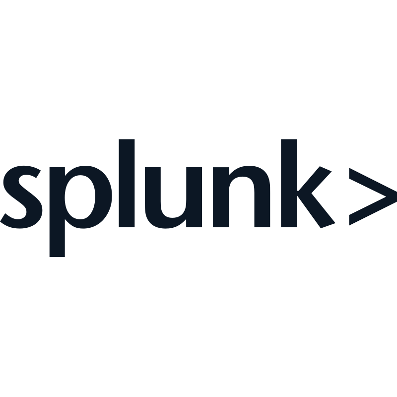

<h1 align="center">CND 💻</h1>

<b><code>IT Student (1st year of Cybersecurity Engineering)</code></b>

I'm a 20-year-old computer science student. I'm currently working on a variety of projects, both school-related and personal, mainly in the fields of cybersecurity and programming. I try to enrich my knowledge every day.

<!-- Cloud Fundamentals Certifications -->
<h2 align="center">🎓 My Cybersecurity Certifications</h2>

  <table style="width:100%; table-layout:fixed;">
    <colgroup>
      <col style="width:16.66%">
      <col style="width:16.66%">
      <col style="width:16.66%">
    </colgroup>
    <tr>
      <!-- Icon Row -->
      <td align="center">
        
      </td>
      <td align="center">
        
      </td>
      <td align="center">
        
      </td>
    </tr>
    <tr>
      <!-- Text Row -->
      <td align="center" valign="top">
        🗓️ Nov 2024  
        🔗 <a href="https://tryhackme-certificates.s3-eu-west-1.amazonaws.com/THM-BCYDK6ZNW0.pdf">Credential</a> 
        
TryHackMe Cybersecurity 101

      </td>
      <td align="center" valign="top">
        🗓️ Oct 2024  
        🔗 <a href="https://tryhackme-certificates.s3-eu-west-1.amazonaws.com/THM-BCYDK6ZNW0.pdf">Credential</a> 
        
TryHackMe Pre Security

      </td>
      <td align="center" valign="top">
        🗓️ Nov 2023  
        🔗 <a href="https://www.credly.com/badges/1381d01a-df15-4792-b684-ed13abf07da2/public_url">Credential</a> 
        
IBM Cybersecurity Fundamentals

      </td>
    </tr>
  </table>

## 🧱 Skills & Technologies

## 🛡️ Cybersecurity Journey

### 🧰 Tools I've Learned Through TryHackMe

